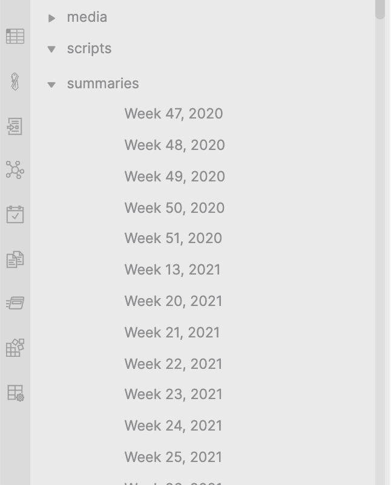

# Obsidian File Explorer Note Titles

Shows note's title instead of just a filename in file-explorer.

The title is resolved as:
- title field in frontmatter
- first alias in frontmatter
- first header in the note.
It's possible to turn of any of those sources in Settings

Also replaces the titles in the graphview with the note's title.

Forked from and based on [file-explorer-markdown-titles](https://github.com/Dyldog/file-explorer-markdown-titles)